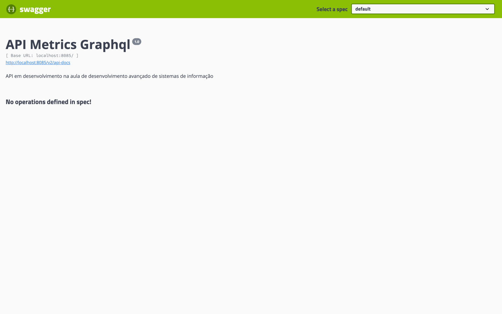

# API Metrics GraphQl

   

## Tópicos

  • <a href="#Descrição do Projeto">Monitoramento do serviço Encurtador de URL</a> •
  <a href="#tecnicas-e-tecnologias-utilizadas">Geração de metricas de uso do serviço</a> •

[//]: # (## Descrição do Projeto)

[//]: # ()
[//]: # (
Aplicação Java com SPRING BOOT, desenvolvida na aula de Desenvolvimento avançado de Sistemas de Informação da 4a etapa do curso de Sistemas de informação da Univem.
)

[//]: # (
 * API gerando HASH a partir da URL informada
)

[//]: # (
 * Balanceador de carga &#40;Nginx&#41;
)

[//]: # (
 * Cache &#40;spring-boot-starter-cache e Redis&#41;
)

[//]: # (
 * Banco de dados &#40;H2&#41;
)

[//]: # (## Próximos passos)

[//]: # ()
[//]: # (
)

[//]: # (  • <a href="#Descrição do Projeto">Migrar parra banco de dados MySql </a>•)

[//]: # (  <a href="#tecnicas-e-tecnologias-utilizadas">Adicionar autenticação e proteção aos endpoints</a> •)

[//]: # (  <a href="#abrir-e-rodar">Gerenciamento do cache</a> •)

[//]: # (  <a href="#acesso-ao-projeto">Deploy na AWS</a> )

[//]: # (
)

## Integrantes da equipe

Gabriel Menoi - RA:602655

Matheus Araújo - RA:603236

Matheus Assunção - RA:602000

Tiago Santos - RA:603181

Vitor Studzieski - RA:608661
